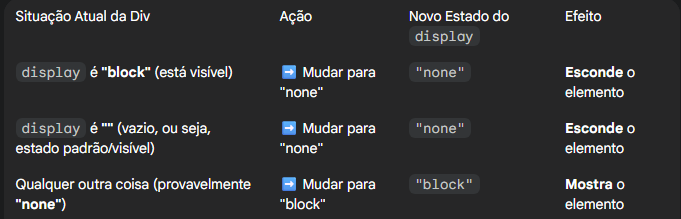

lampada.src.match => variável + atributo onde está definido o nome do arquivo + match

=> independente se o script estiver no head ou no body, as funções executam somente quando sao chamadas (invocadas.)

classe => orientação a objeto
javascript também tem.

getMonth retorna um índice, e todo índice começa com 0. e com isso, pensamos em um Array. uma lista. o meu array sempre começa com índice 0:

0 - JAN
1 - FEV
2 - MAR
3 - ABR
4 - MAI
5 - JUN
6 - JUL
7 - AGO
8 - SET
9 - OUT

variável fora de uma função: global
variável dentro de uma função: local

============================================================================
let => variável local (navegadores modernos)
var/const => variável global (navegadores antigos)
============================================================================

PRECISA CHAMAR ARGUMENTOS.

setInterval => ele executa alguma coisa dentro de um intervalo de tempo, fica no loop até ser interrompido.

handler => o que quero executar
timeout => de quanto em quanto tempo eu quero executar aquilo que eu desejo executar.
timeout?: number => valor numero em milisegundos
..... argumentos: any[]): number => opcional, pode ou nao

    

A função principal desse código é mover um elemento na tela de forma gradual e animada até uma posição específica. 🚶‍♂️

🧐 Como a função andar() funciona:
1. Define a Posição Inicial:
    - pos = 0;
    - Cria uma variável chamada pos e a define como zero. Essa variável controlará a posição do elemento.

2. Encontra o Elemento:
    - menor = document.getElementById("menor");
    - Busca na sua página HTML um elemento (como uma 
, por exemplo) que tenha o id (identificador) "menor" e armazena-o na variável menor.

3. Inicia o Movimento (Animação):
    - x = setInterval(mover, 5)
    - Chama a função mover() repetidamente a cada 5 milissegundos (muito rápido), criando o efeito de animação. O resultado desse intervalo é armazenado em x.

4. A Função de Movimento (mover()):
    - Esta função é executada a cada 5ms:
        - pos++; : Aumenta a posição em 1 (de 0 para 1, depois para 2, 3, e assim por diante).
        - menor.style.marginTop = pos + "px"; e menor.style.marginLeft = pos + "px"; : Muda a posição do elemento "menor" na tela, movendo-o para baixo (margem superior) e para a direita (margem esquerda) a cada passo.
        - menor.style.backgroundColor = "#cecece" : Muda a cor de fundo do elemento para cinza claro durante o movimento.

        - Condição de Parada:
            - if(pos == 650) { clearInterval(x); }
            - Quando a posição atinge 650 pixels, a linha clearInterval(x) é executada e interrompe a repetição da função mover(), parando a animação.

Em resumo, o código faz o elemento com o ID "menor" se mover na diagonal (para baixo e para a direita) por 650 pixels, enquanto muda sua cor de fundo.

===============================================================================

        function exibir() {
            minhaDiv = document.getElementById("minhaDiv");
            minhaDiv.style.display= (minhaDiv.style.display === "block" || minhaDiv.style.display === "") ? "none" : "block";
        }

A função principal dessa nova função, exibir(), é esconder ou mostrar um elemento HTML a cada vez que é chamada. Ela funciona como um "interruptor" de visibilidade. 💡

🧐 Como a função exibir() funciona:
1. Encontra o Elemento:
    - minhaDiv = document.getElementById("minhaDiv");
    - A função procura na página o elemento que tem o id "minhaDiv" (provavelmente uma 
) e armazena-o na variável minhaDiv.

2. Define a Regra de Exibição (O Interruptor):
    - minhaDiv.style.display = (minhaDiv.style.display === "block" || minhaDiv.style.display === "") ? "none" : "block";
    - Esta é a parte chave, uma condição ternária (atalho para if/else). Ela verifica o estado atual da propriedade display do elemento e faz o seguinte:

    